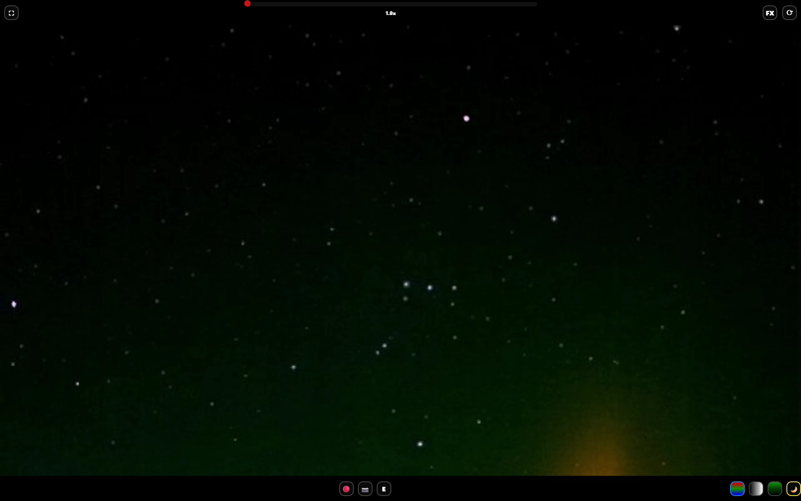

# sionyx-streamer

Live video stream controls and star viewing enhancement for the SiOnyx Aurora night vision camera.


The SiOnyx app kinda works but this is much better.  With a Raspberry Pi plugged into your network, you can live stream video from the camera's wireless mode, control it, and enhance the image for night scenes from any phone or computer on the network at http://sionyx:8080. The default SiOnyx live view is very glitchy with its mjpg stream so this page is a much more robust way to view it. This web interface lets you see the RAW and the FX enhanced stream. Within the FX stream you can select between light and dark mode.  Dark mode does a lot for seeing stars. This web interface also controls zoom, record, photo, and change color modes. Keep the camera quite close to the Raspberry Pi since its wifi is weak and it will drop frames.

The SiOnyx sensor has an unusual low-light response curve that produces false color in dark areas; blacks tend to be quite green, or occasionally blue or red. Correcting this with a simple curves adjustment throws away detail. The dark mode enhancement lifts signal of small dots while keeping the background fairly black as you'd expect in astrophotography.


G4 Aurora at 39°N 19 2026-01-19 (The blue glow is the infrared from my phone in the room - oops)

In practice this means you can track faint satellites, easily see shooting stars, and watch the aurora clearly in real time. It reliably picks up magnitude -5.0 stars and often reaches -6.8 and star colors are occasionally preserved. To smooth out MJPEG compression noise and prevent stars from flickering in and out, images are averaged over 8 frames of the 15fps stream by default - still responsive enough to feel like a live view.  You can select 2,4,6,8,16,32,64 and 128 frame stacks to analyze. The controls are kinda clunky but it works even on mobile!

The detection algorithm uses ADMD (a small-target detection technique) and some custom image processing so one inherent limitation is stars within about 2 pixels of each other may look like a single point but the Pleiades cluster comes through well though. You can run this enhancement on a local machine with the recorded .mov files as well for higher quality, resolution, and framerate.

The system is currently optimized for analyzing an average of 8 frames. There is more star data to see by adjusting the noise floor on longer duration analysis but you can play with this yourself.  I think you can get magnitude -7.5 stars over 128 frames if you play with it but that's hardly live video at that point.

There are two ways to use this software:

- **RPi Server** -- a Raspberry Pi connects to your SiOnyx camera over WiFi and
  streams an enhanced live view to any browser on your network.
- **Local Video** (Windows .bat/Linux/Mac) -- process a recorded video file on your PC.

## RPi Server Setup

### What you need

- Raspberry Pi 4 or 5 with Raspberry Pi OS (64-bit recommended)
- Ethernet cable connecting the RPi to your router
- Your SiOnyx camera

### One-time install

1. Copy the contents of the `rpi/` folder onto your Raspberry Pi.

2. Open a terminal on the RPi and run:

       cd sionyx-streamer/rpi
       sudo bash install.sh

3. The installer will ask for your camera's WiFi name (SSID).

   **To find your SSID:** Put your SiOnyx camera into WiFi mode. The camera
   screen will display a network name like `SiOnyx-7854D5`. Enter that exactly.
   This network is hidden -- it will not appear in a normal WiFi scan. The camera
   must be showing the SSID on screen or the RPi cannot connect.

4. The installer will show you the RPi's IP address on your wired network before
   making any changes. Write it down as a backup.

5. Follow the prompts. The whole process takes about two minutes.

### Accessing the stream

Once installed, open a browser on any device on your network and go to:

    http://sionyx.local:8080

If that does not work on your router, use the IP address printed at the end of
the install (e.g. `http://192.168.1.42:8080`).

### How the camera connection works

As long as the RPi is powered on, it will continuously look for the SiOnyx
camera WiFi and connect automatically. You do not need to do anything on the RPi
once it is set up.

**If the stream is not working:**

1. Put the camera into WiFi mode -- the SSID must be visible on the camera screen
2. Clear any warnings on the camera (low battery alerts etc.)
3. Within about 15 seconds of the SSID appearing on screen, the RPi should
   connect and the stream should come up
4. If it is still not working, turn the camera off and back to WiFi mode to reset
   the connection

### Useful commands

Check whether the server is running:

    sudo systemctl status sionyx-streamer

Watch the live log output:

    sudo journalctl -u sionyx-streamer -f

Restart the server manually:

    sudo systemctl restart sionyx-streamer

---

## Windows Local Video Processing

### What you need

- Windows PC
- Python 3.10 or newer -- download from https://www.python.org/downloads/
  (during install, tick "Add Python to PATH")
- A recorded video file from your SiOnyx camera

### One-time install

Double-click `local/install_windows.bat`. This installs the required Python
packages. It only needs to be run once.

### Processing a video

Drag any `.mp4` file onto `local/process_video.bat`.

A preview window will open showing the enhanced output. You will be asked whether
you want to save the result. Press `Q` in the preview window to quit.

You can also double-click `process_video.bat` directly and type in the file path
when prompted.

---

## Folder layout

```
sionyx-streamer/
    rpi/
        install.sh                  RPi installer -- run once with sudo
        camera_config.txt           Camera SSID config -- written by installer
        rpi_server.py               Server application
        index.html                  Web interface
        viewer.js                   Web interface
        (NoSleep.min.js)            (Keeps the viewing device awake)
        sionyx_wifi_watchdog.py     Makes and maintains the wifi connection to the camera
        sionyx-server.service
        sionyx-wifi.service
    local/
        install_windows.bat         Windows installer -- run once
        process_video.bat           Drag video files onto this
        local_video_star_enhancement.py     A local version to process .mov or the raw stream
```
